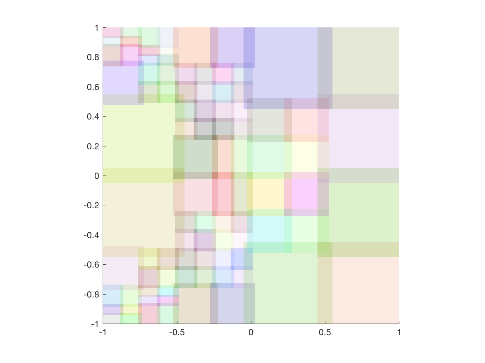
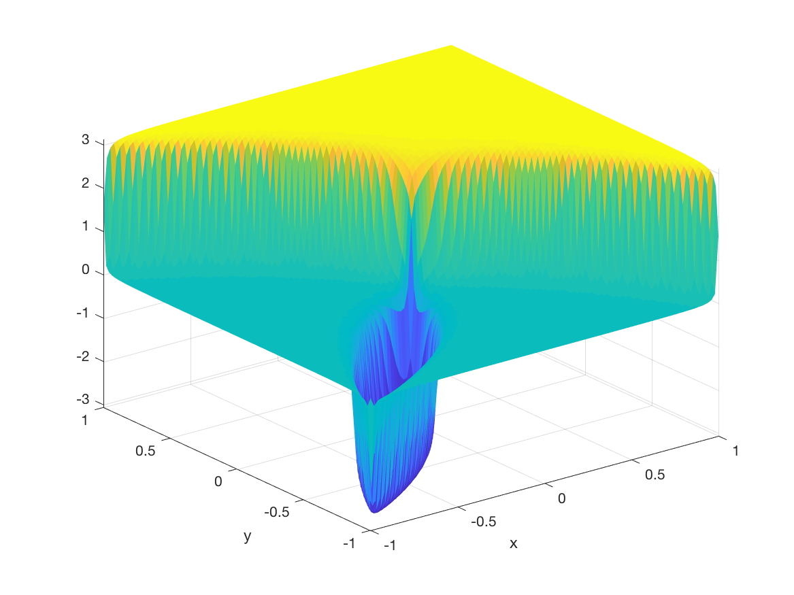
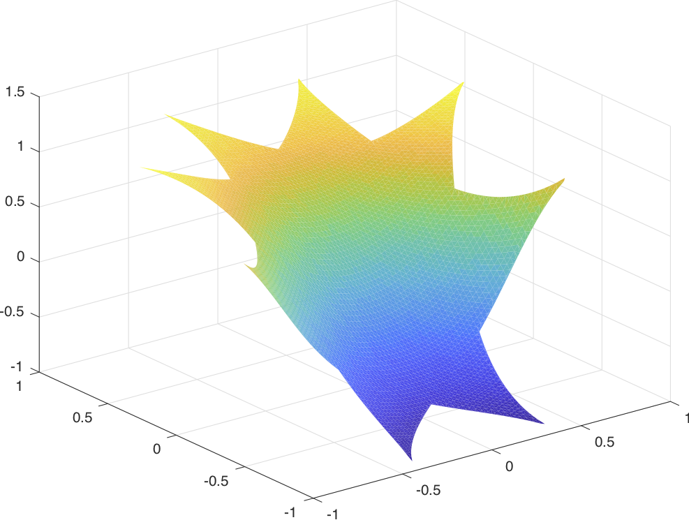
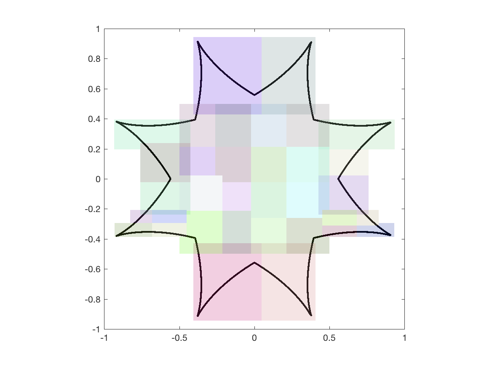

# PUchebfun

PUchebfun provides a way to represent multivariate functions (up to 3D) with a partition of unity approximation consisting of
Chebyshev tensor product polynomials. These approximations are infinitely smooth, highly accurate and memory efficient. The overlapping domains are formed through recursive bisection, and are organized into a binary tree.


## Prerequisites

* Matlab 2017a

* [chebfun](http://www.chebfun.org/) 5.5

## Authors

* Kevin W. Aiton

* Tobin A. Driscoll

## Examples

To construct an aproximation on the square [-1 1;-1 1] we can call:

```Matlab
F = PUchebfun(@(x,y) atan(50*(x+y.^2)));
```

PUchebfun can be called this way for 1D-3D functions for the domain [-1 1]^d. To plot functions and see the subdomains, we call:

```Matlab
plot(F);
figure(), show(F);
```

 
 We can also compute the norm of F, integrate F over [-1 1;-1 1], and compute F(x,y)d/dx with:
 
 ```Matlab
norm(F)
sum(F)
diff(F,1,1)
```

Furthermore, PUChebfuns can be symboically combined like so:

 ```Matlab
F1 = PUchebfun(@(x,y) atan(100*(x+y.^2)));
F2 = PUchebfun(@(x,y) atan(100*(x.^2+y)));
F3 = F1 + F2;
plot(F3)
figure(), show(F3);
```


# PUFunLS

We have included some preliminary work with creating Chebyshev approximations with non-rectangular domains. We can build an approximation on two overlayed astroid curves like so:

 ```Matlab
F = PUFunLS(@(x,y)atan(x.^2+y),DoubleAstroid(),[-0.95 0.95;-0.95 0.95],'tol',1e-10)
```


